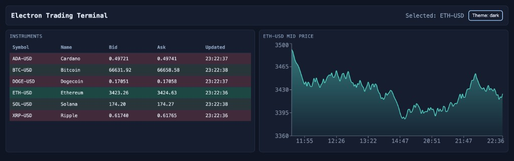
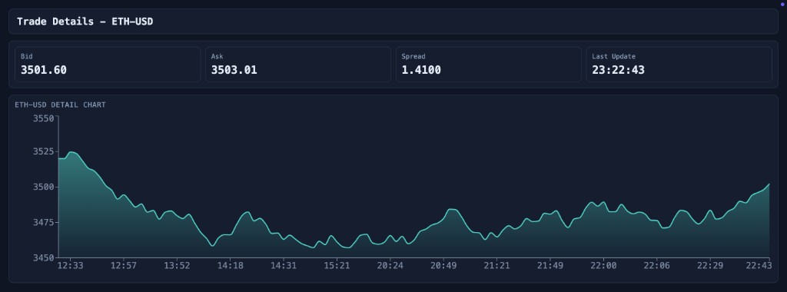

# Electron Trading Terminal (Demo)

Production-like demo application built with Electron + React + TypeScript that simulates a real-time trading terminal.

## Screenshots

### Main Window



### Trade Details Window



## Tech Stack

- Electron (main + preload)
- React + TypeScript
- Vite (renderer bundling)
- Redux Toolkit + Reselect
- Mock WebSocket stream (no backend)
- Recharts for real-time charting

## Project Structure

```text
src/
  main/        # Electron main process (windows, IPC, window state)
  renderer/    # React UI, Redux store, websocket mock, charts
  shared/      # Shared TS types and IPC channel contracts
```

## Run Locally

```bash
npm install
npm run dev
```

This starts:

- Vite dev server (renderer)
- `tsup --watch` for Electron main/preload
- Electron with auto-restart on main-process changes

## Production Build

```bash
npm run build
npm run start
```

`build` outputs:

- `dist/renderer` (Vite static build)
- `dist/main` (compiled main/preload scripts)

## Architecture

### Main Process (`src/main`)

- Creates and manages:
  - Main window: terminal dashboard
  - Secondary window: trade details
- Handles secure IPC contracts:
  - open details window
  - selected symbol synchronization across windows
  - theme synchronization across windows
- Persists per-window geometry to user data (`window-state.json`)

### Preload (`src/main/preload.ts`)

- Uses `contextBridge` to expose a minimal, typed `window.electronAPI`
- `contextIsolation` is enabled and renderer has no direct Node API access
- All privileged actions (window creation, cross-window broadcast) go through IPC

### Renderer (`src/renderer`)

- Redux architecture:
  - `instruments` slice (normalized with entity adapter)
  - `prices` slice (symbol-indexed normalized map with bounded history)
  - `ui` slice (selected symbol + dark mode)
- Reselect memoized selectors avoid unnecessary recalculations
- Table rows subscribe per-symbol to reduce global rerenders

## IPC Flow

1. User clicks a symbol row in the main table
2. Renderer sends `window:open-trade-details` (invoke)
3. Main process opens/focuses detail window and broadcasts `selection:updated`
4. Both windows update selected symbol through `selection:updated` listener

Theme sync flow:

1. Renderer toggles local theme state
2. Renderer sends `theme:set`
3. Main stores theme and broadcasts `theme:updated`
4. All windows apply the same theme

## Real-time Data Simulation

- `MockPriceSocket` emits random bid/ask ticks every **100–500ms**
- Tick format:

```ts
{
  symbol: string;
  bid: number;
  ask: number;
  timestamp: number;
}
```

- Feed updates are batched with `requestAnimationFrame` before dispatching into Redux to keep rendering smooth under high update frequency.

## Performance Optimizations

- `React.memo` for high-frequency components (`InstrumentRow`, `InstrumentTable`, `PriceChart`)
- Per-symbol selector factories (`makeSelectInstrumentRow`, `makeSelectSymbolHistory`)
- Bounded price history window to keep chart memory stable
- RAF batching for websocket ticks to reduce dispatch pressure
- Chart animations disabled for fast, frequent data updates

## Demo Features Checklist

- [x] Main + secondary Electron windows
- [x] IPC with `ipcMain` / `ipcRenderer`
- [x] Secure preload and isolated renderer
- [x] Real-time instrument table
- [x] Price flash on up/down updates
- [x] Click row to open details window
- [x] Real-time chart for selected instrument
- [x] Redux Toolkit normalized store + memoized selectors
- [x] Multi-window selection sync via main process
- [x] Dark mode toggle synced between windows
- [x] Window size/position persistence
